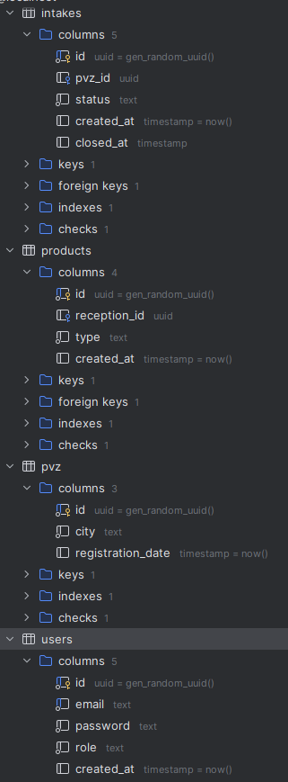
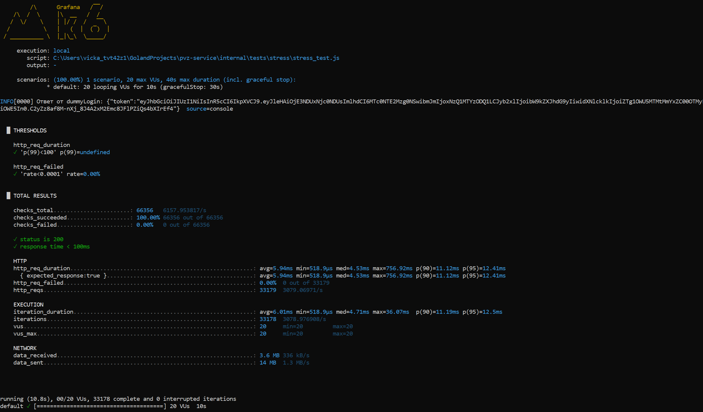

# Управление ПВЗ (Пункты Выдачи Заказов)

## Установка и запуск

```
git clone https://github.com/Cheshire-Cat74/pvz-service.git
cd полный путь(например C:\Users\vicka_tvt42z1\GolandProjects\pvz-service) - для windows
go mod tidy(должен быть установлен golang)
docker compose up(должен быть установлен docker) - для windows
```

## Настройка

Приложение использует несколько переменных окружения:

- ```DATABASE_HOST```: Хост базы данных. По умолчанию используется db.  
- ```DATABASE_PORT```: Порт базы данных. По умолчанию используется 5432.  
- ```DATABASE_USER```: Имя пользователя для подключения к базе данных. По умолчанию используется postgres.  
- ```DATABASE_PASSWORD```: Пароль для подключения к базе данных. Установите его на значение, которое вы используете (например, password).  
- ```DATABASE_NAME```: Имя базы данных. По умолчанию используется pvz.  
- ```SERVER_PORT```: Порт, на котором будет работать сервер. По умолчанию используется порт 8080.  
- ```JWT_SECRET```: Секретный ключ для аутентификации JWT. Установите его на значение, которое вы хотите использовать (например, your-secret-key).  

## Структура проекта
```
.
├── cmd/app/                  # Основное приложение
│   ├── main.go               # Точка входа
│   └── app/                  # Инициализация приложения
├── internal/                 # Внутренние модули
│   ├── config/               # Конфигурация
│   ├── db/                   # Подключение к БД
│   ├── grpc/                 # gRPC сервер
│   ├── handler/              # HTTP обработчики
│   ├── middleware/           # Промежуточное ПО
│   ├── domain/               # Модели данных
│   ├── service/              # Бизнес-логика
│   ├── prometheus/           # Метрики Prometheus
│   ├── proto/                # Protobuf файлы
│   ├── repository/           # Работа с БД
│   ├── tests/                # Интеграционные тесты
│   └── utils/                # Вспомогательные утилиты
├── migrations/               # Миграции БД
├── taskDescription/          # Условия задачи 
├── .env                      # Переменные окружения
├── Dockerfile                # Конфигурация Docker
├── docker-compose.yaml       # Конфигурация Docker Compose
├── go.mod                    # Зависимости Go
├── go.sum                    # Хеши зависимостей
└── prometheus.yml            # Конфигурация Prometheus
```
## Структура базы данных



## Мониторинг
- Prometheus доступен на ```http://localhost:9090```;
- Метрики приложения доступны на ```http://localhost:<порт-метрики>/metrics```;

## GRPC
- GRPC доступен на ```http://localhost:3000```
- Возвращает все добавленные в систему ПВЗ.

## Тестирование
- Unit-тесты запускаются через Dockerfile;
- После успешного прохождения тестов, собирается образ;
- Интеграционный тест запускается после того, как запуститься всё приложение через консоль в корне проекта следующей командой ``` go test ./internal/tests/... -v```;
- Вывод процента тестового покрытия можно осуществить через консоль в корне проекта следующей командой ```go test -cover ./internal/handlers/... ./internal/processors/... ./internal/repository/...```;
- Процент покрытия:
``` 
ok      pvz-service/internal/handler     0.408s  coverage: 85.3% of statements
ok      pvz-service/internal/service     11.306s coverage: 81.5% of statements
ok      pvz-service/internal/repository  0.599s  coverage: 84.5% of statements
```
## Нагрузочное тестирование

### Цель

Проверить RPS, среднее время отклика и долю успешных запросов

### Требования

- RPS >= 1000
- SLI отклика < 100ms
- SLI успеха ответов — 99.99%

### Установка k6 для Windows
- Скачайте `.exe` файл с [https://grafana.com/docs/k6/latest/examples/get-started-with-k6/]  и добавьте путь в `PATH`.
- Запускается командой k6 run "путь к файлу stress_test.js"

### Результат


